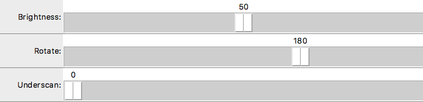
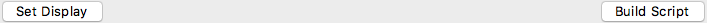
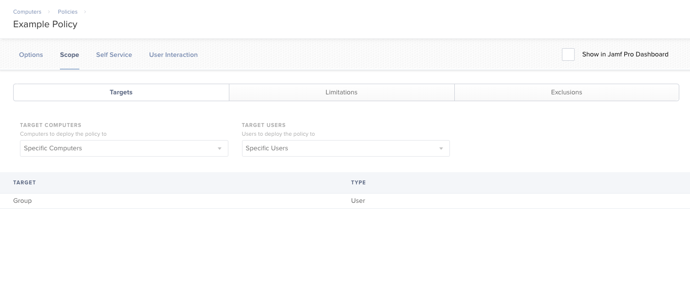
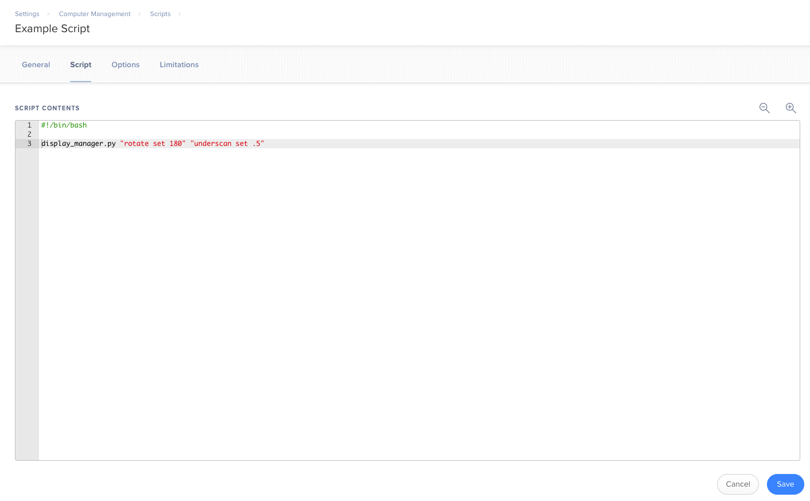

Display Manager
===============

An open-source Python library which can modify your Mac's display settings.

Includes the library itself, and a command-line API + GUI to use it in pre-specified ways.

You can download the installer [here](./versions/Display Manager v1.0.0.dmg).

## Contents

* [Contact](#contact) - how to reach us
* [System Requirements](#system-requirements) - what you need
* [Purpose](#purpose) - what can be done with Display Manager?
* [Limitations](#limitations) - what *can't* be done with Display Manager?
* [Get Started](#get-started) - how to get started with Display Manager
* [Overview](#overview) - what is included in this library?
 * [Library](#library)
 * [Command-Line API](#command-line-api)
 * [GUI](#gui)
* [Command-Line Usage](#command-line-usage) - how to use the command-line API
 * [Help](#help)
 * [Show](#show)
 * [Res](#res)
 * [Rotate](#rotate)
 * [Brightness](#brightness)
 * [Underscan](#underscan)
 * [Mirror](#mirror)
* [Usage Examples](#usage-examples) - potential use cases for Display Manager
 * [Library Examples](#library-examples)
 * [Command-Line Examples](#command-line-examples)
 * [System Administration Examples](#system-administration-examples)
* [Update History](#update-history)

## Contact

If you have any comments, questions, or concerns, feel free to [send us an email](mailto:mlib-its-mac-github@lists.utah.edu).

## System Requirements

Display Manager only runs on Mac computers. It depends on the Apple-supplied Python 2.7 binary, which lives at `/usr/bin/python` and comes pre-configured with the PyObjC bindings. These bindings allow Python to access the Objective-C methods that perform display manipulations.

If you have replaced the setDefault `/usr/bin/python` binary (which is not generally advised), you should ensure that it has the PyObjC bindings set up correctly.

Note: Display Manager has only been tested on El Capitan, Sierra, and High Sierra. If you experience issues on other versions of macOS, please [let us know](#contact).

## Purpose

Display Manager programmatically manages Mac displays, including [display resolution, refresh rate](#res), [brightness](#brightness), [rotation](#rotate), [screen mirroring](#mirror), and [HDMI underscan](#underscan). Its primary intended purpose is to allow system administrators and developers to automatically configure any number of Mac displays, by use of the command-line scripts and the Display Manager Python library.

Several intended use-cases for Display Manager are elaborated in [usage examples](#usage-examples).

## Limitations

Currently, Display Manager has a few important limitations that are worth noting:

* Can't configure displays at Mac login screen.
 * Recommended workaround: simply configure displays *during* login/logout, or while logged in. Settings persist after logout, so whichever configurations you set during logout will remain active at the login screen.
* Displays are controlled via `DisplayID`, so any interactions with external displays via the command line must be performed by reference to that display's `DisplayID`. (However, any interactions with the main display don't need to specify its `DisplayID` -- it is implied, unless otherwise noted.)
 * Recommended workaround: try manipulating the external displays (e.g. brightness, rotation, resolution, etc.) by their `DisplayID` to see which physical screens they correspond to.

Note: DisplayIDs are metadata descriptions of display capabilities. For more information, see [here](https://en.wikipedia.org/wiki/DisplayID).

## Get Started

First, check that your system satisfies the requirements in [System Requirements](#system-requirements). If you haven't played around with `/usr/bin/python`, it should.

Next, download the latest installer [here](./versions/Display Manager v1.0.0.dmg), or view the archive of all version installers [here](./versions). Included within are two files: `Display Manager.pkg`, and `Uninstall Display Manager.pkg`. To install, click the former and follow the prompts on-screen; to uninstall, do the same for the latter.

For the curious: `Display Manager.pkg` puts the [Display Manager library](#library) in `/Library/Python/2.7/site-packages/`, the [command-line interface](#command-line-api) in `/usr/local/bin`, and the [GUI](#gui) in `/Applications`; `Uninstall Display Manager.pkg` removes all three of these.

Next, see [Overview](#overview) for an idea of what you can do with Display Manager.

## Overview

The Display Manager suite comes in 3 parts: the Display Manager library (display_manager.py), the command-line API (manage_displays.py), and the GUI (gui.py).

### Library

The Display Manager library is housed in display_manager.py, which contains the following:

* The `Display` class is a virtual representation of a connected physical display. It allows one to check the status of various display parameters (e.g. brightness, resolution, rotation, etc.) and to configure such parameters.
* The `DisplayMode` class is a simple representation of Quartz's Display Modes. DisplayModes can be sorted, converted to strings, and passed as parameters to various methods which configure the display.

* `getMainDisplay` returns the primary `Display`;
* `getAllDisplays` returns a `Display` for each connected display
* `getIOKit` allows one to manually access the IOKit functions and constants used in Display Manager (usage not recommended -- it's much simpler to go through `Display`s instead, if possible)

### Command-Line API

The command-line API, accessed via manage_displays.py, allows you to manually set [display resolution, refresh rate](#res), [brightness](#brightness), [rotation](#rotate), [screen mirroring](#mirror), and [HDMI underscan](#underscan). See [command-line usage](#command-line-usage) below for more information.

### GUI

First, set the display you'd like to configure the settings for in the displays dropdown menu. Any time you select a display, all of the other menus automatically switch to that display's current settings, but you can refresh them manually by clicking the "refresh" button.


Next, select the display settings you'd like from the other menus. Note that the brightness, rotation, and underscan sliders default to 0 and cannot be changed if your display does not allow us to access them.



To configure screen mirroring, select the display you'd like to mirror, and choose whether to enable or disable it.


Finally, select either "Set Display" or "Build Script". If you click "Set Display", the display will be configured to the settings you've selected. If you pick "Build Script", you'll be given a file dialog to save a script which sets your display to these settings automatically whenever run (using the commands seen in [manage_displays.py](#command-line-api)).



## Command-Line Usage

The Display Manager command-line API supports the following commands:

`$ manage_displays.py [command]`

For more information on each command, see its section below:

### Help

Use `help` to see help documentation for any command.

Usage: `$ manage_displays.py help [command]`

| Commands | Description |
|---|---|
| `help` | Show help information about a command |
| `show` | Show current/available display configurations |
| `res` | Manage the display resolution |
| `brightness` | Manage display brightness |
| `rotate` | Manage display rotation |
| `underscan` | Manage display underscan |
| `mirror` | Manage screen mirroring |

#### Examples

* Show help information for the `res` command:

`$ manage_displays.py help res`

* Show general help information to see which commands are available:

`$ manage_displays.py help`

### Show

Use `show` to learn more about the supported display configurations for your hardware.

Usage: `$ manage_displays.py show (subcommand) (options) (scope)`

| Subcommands (optional) | Description |
|---|---|
| `current` (default) | Show the current display settings |
| `highest` | Show the highest available resolution |
| `available` | Show a list of all the available resolutions |

| Options (optional) | Description |
|---|---|
| `no-hidpi` | Don't show HiDPI resolutions |
| `only-hidpi` | Only show HiDPI resolutions |

Notes:
* "HiDPI" , also known as "Retina Display" among Apple products, refers to a high ratio of pixels (or "dots" in "dots per inch"/"DPI") to the physical area they occupy in a display. Fore more information, see [here](https://en.wikipedia.org/wiki/Retina_Display)
* By default, both HiDPI and non-HiDPI resolutions are shown.

| Scope (optional) | Description |
|---|---|
| `main` | Perform this command on the main display |
| `ext<N>` | Perform this command on external display number `N` (starting at 0) |
| `all` (default) | Perform this command on all connected displays |

#### Examples

* Show all displays' current configurations:

`$ manage_displays.py show`

* Show the highest available HiDPI resolution for the main display:

`$ manage_displays.py show highest only-hidpi main`

* Show all available resolutions for the first external display:

`$ manage_displays.py show available ext0`

### Res

Use `res` to modify display resolution and refresh rate. (Checking desired settings through [`show`](#show) beforehand is recommended.)

usage: `$ manage_displays.py res [resolution] (refresh) (options) (scope)`

| Resolution | Description |
|---|---|
| `highest` | Set the display to the highest available resolution |
| `<width> <height>` | Width and height (in pixels) |

Note: width and height must be separated by at least one space.

| Refresh (optional) | Description |
|---|---|
| `<refresh>` | Refresh rate (in Hz) |

Note: if refresh rate is not specified, it will default to whichever rate is available at the desired resolution

| Options (optional) | Description |
|---|---|
| `no-hidpi` | Don't set to HiDPI resolutions |
| `only-hidpi` | Only set to HiDPI resolutions |

Notes:
* "HiDPI" , also known as "Retina Display" among Apple products, refers to a high ratio of pixels (or "dots" in "dots per inch"/"DPI") to the physical area they occupy in a display. Fore more information, see [here](https://en.wikipedia.org/wiki/Retina_Display)
* By default, both HiDPI and non-HiDPI resolutions are shown.

| SCOPE (optional) | Details |
|---|---|
| `main (default)` | Perform this command on the main display |
| `ext<N>` | Perform this command on external display number `N` (starting at 0) |
| `all` | Perform this command on all connected displays |

#### Examples

* Set the main display to 1920x1080:

`$ manage_displays.py res 1920 1080`

* Set all displays to their highest available resolution:

`$ manage_displays.py res highest all`

* Set the first external display to 1024x768 at 60Hz:

`$ manage_displays.py res 1024 768 60 ext0`

### Rotate

Use `rotate` to change your display's orientation.

usage: `$ manage_displays.py rotate [angle] (scope)`

| Angle | Description |
|---|---|
| `<angle>` | Desired display rotation; must be a multiple of 90 |

| Scope (optional) | Description |
|---|---|
| `main (default)` | Perform this command on the main display |
| `ext<N>` | Perform this command on external display number `N` (starting at 0) |
| `all` | Perform this command on all connected displays |

#### Examples

* Rotate the main display by 90 degrees (counter-clockwise):

`$ manage_displays.py rotate 90`

* Return all displays to default orientation:

`$ manage_displays.py rotate 0 all`

### Brightness

Use `brightness` to set the brightness on your display.

usage: `$ manage_displays.py brightness [brightness] (scope)`

| Brightness | Description |
|---|---|
| `<brightness>` | A number between 0 and 1 (inclusive); 0 is minimum brightness, and 1 is maximum brightness |

| Scope (optional) | Description |
|---|---|
| `main (default)` | Perform this command on the main display |
| `ext<N>` | Perform this command on external display number `N` (starting at 0) |
| `all` | Perform this command on all connected displays |

#### Examples

* Set the brightness of the main display to half of its maximum brightness:

`$ manage_displays.py brightness .4`

* Set the brightness of all displays to their maximum:

`$ manage_displays.py brightness 1 all`

Note: many displays do not support setting brightness automatically; this is most often the case with external monitors.

### Underscan

Use `underscan` to configure HDMI underscan settings.

usage: `$ manage_displays.py underscan [underscan] (scope)`

| Underscan | Description |
|---|---|
| `<underscan>` | A number between 0 and 1 (inclusive); 0 is minimum underscan, and 1 is maximum underscan |

| Scope (optional) | Description |
|---|---|
| `main (default)` | Perform this command on the main display |
| `ext<N>` | Perform this command on external display number `N` (starting at 0) |
| `all` | Perform this command on all connected displays |

Note: HDMI underscan settings can fix displays that under-render images, causing the outer edge of the screen to be left empty. Displays default to underscan 0. For more details, see [here](https://support.apple.com/en-us/ht202763).

#### Examples

* Set main display to 0% underscan:

`$ manage_displays.py underscan 0`

* Set all displays to 42% underscan:

`$ manage_displays.py underscan .42 all`

### Mirror

Use `mirror` to enable or disable display mirroring.

usage:

* `$ manage_displays.py mirror enable [source] [target(s)]`
* `$ manage_displays.py mirror disable (scope)`

| Subcommands | Description |
|---|---|
| `enable` | Set `<target>`s to mirror `<source>` |
| `disable` | Disable mirroring on `<scope>`s |

| Source/Target(s) (not used by `disable`) | Description |
|---|---|
| `source` | The display which will be mirrored by the `target`s; must be a single element of `<SCOPE>` (see below); cannot be `all` |
| `target(s)` | The display(s) which will mirror the `source`; must be an element of `<SCOPE>` (see below) |

| SCOPE | Description |
|---|---|
| `main` | The main display |
| `ext<N>` | External display number `N` (starting at 0) |
| `all` (default scope for `disable`) | For `enable`: all connected displays besides `source` (only available to `target`); for `disable`: all connected displays |

#### Examples

* Set all external displays to mirror the main display:

`$ manage_displays.py mirror enable main all`

* Set the main display and the first external display to mirror the second external display:

`$ manage_displays.py mirror enable ext1 main ext0`

* Stop mirroring on all displays:

`$ manage_displays.py mirror disable`

* Stop mirroring on the main display:

`$ manage_displays.py mirror disable main`

## Usage Examples

Display Manager allows you to manipulate displays in a variety of ways. You can write your own scripts with the [Display Manager library](#library), manually configure displays through the [command-line API](#command-line-api), or access the functionality of the command-line API through the [GUI](#gui). A few potential use cases are outlined below:

### Library Examples

First, import the Display Manager library, like so:

```
from DisplayManager import *
```

Next, say you'd like to automatically set all the displays connected to your computer to their highest resolution. A simple script might look like this:

```
for display in getAllDisplays():
    display.setMode(display.highestMode())
```

Perhaps you'd like your main display to rotate to 90 degrees. The following would work:

```
display = getMainDisplay()
display.setRotate(90)
```

You can use any of the properties and methods of `Display` objects to configure their settings, which is exactly how the [command-line API](#command-line-api) works.

### Command-Line Examples

In many cases, it may be desirable to configure displays from the command line, whether manually or via a script. Say you'd like a script to automatically set a display to its highest available resolution. The following would do just that:

`$ manage_displays.py res highest`

But, in many cases, you might want to call several such commands at the same time. Of course, you may write them out line-by-line, but this takes a little longer, and more importantly, running several commands in this way may lead to undesired interference between commands. As such, it is recommended that multiple commands be run like so:

`$ manage_displays.py res 1920 1080 rotate 90 brightness .5 ...`

In this way, you may pass in as many commands as you like, and Display Manager will find a way to run them simultaneously without encountering configuration errors.

Note: only one `help` command may be run at a time, but any number of other commands may be run simultaneously in a non-blocking fashion.

### System Administration Examples

#### Jamf Pro

"Jamf Pro, developed by Jamf, is a comprehensive management system for Apple macOS computers and iOS devices... \[including\] deploying and maintaining software, responding to security threats, distributing settings, and analyzing inventory data." <sup>[source](https://its.unl.edu/desktop/jamf-casper-suite-faqs/)</sup>

Suppose you'd like all computers in a particular Jamf Pro [scope](http://docs.jamf.com/9.9/casper-suite/administrator-guide/Scope.html) to default to their highest ["retina-friendly" resolution](#res) at maximum brightness at login. You could create a policy



and add a script containing the following to it

```
#!/bin/bash

# Check to make sure the library and command-line API are both installed
if [[ -e /Library/Python/2.7/site-packages/display_manager.py && \
	-e /usr/local/bin/manage_displays.py ]] ; then
	
	manage_displays.py res highest only-hidpi brightness 1
	exit 0

else
	exit 1
fi
```

like so:



For more details about command-line usage, see [here](#command-line-usage); for examples, see [command-line examples](#command-line-examples).

#### Outset

"Outset is a script which automatically processes packages, profiles, and scripts during the boot sequence, user login, or on demand." <sup>[source](https://github.com/chilcote/outset)</sup>

Perhaps you're managing several sideways-rotated wall-mounted HDMI displays via Outset, and you'd like them to automatically display right-side-up and set underscan to 50%. You could save the following script to `/usr/local/outset/boot-every/flip.sh`:

```
#!/bin/bash

# Check to make sure the library and command-line API are both installed
if [[ -e /Library/Python/2.7/site-packages/display_manager.py && \
	-e /usr/local/bin/manage_displays.py ]] ; then
	
	manage_displays.py rotate 90 underscan .5
	
else
	exit 1
fi
```

For more details about command-line usage, see [here](#command-line-usage); for examples, see [command-line examples](#command-line-examples).

## Update History

| Date       | Version | Update |
|------------|---------|--------|
| 2018-07-13 | 1.0.0 | First edition of full Display Manager. Created the DisplayManager library and the new command-line API, added the ability to run multiple commands at once, added a GUI, and added rotation and HDMI underscan features. |
| 2015-10-28 | 0.1.0 | Legacy iteration of Display Manager. Created command-line API. |
